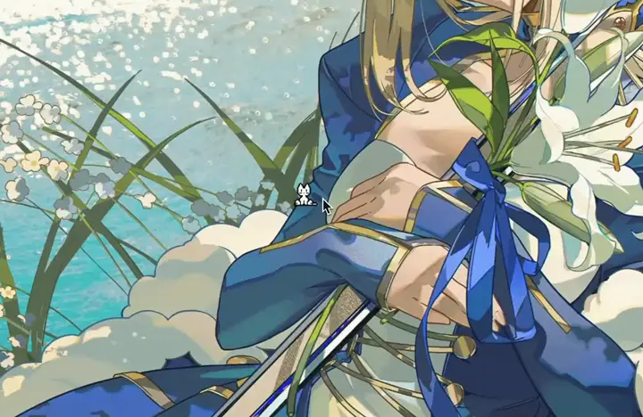

# neko

A tiny menu bar kitten that follows your mouse on macOS.

<p align="center">
  
</p>

It floats above every window, including fullscreen apps. There is no Dock icon. Click the cat in the menu bar to change size and speed, hide it, or start it when you log in.

## Install

macOS 12 or later. Apple silicon and Intel.

1. Download the disk image from the [latest release](https://github.com/Chinteyley/neko/releases/latest).
2. Open it.
3. Drag `neko` onto the Applications folder.

Releases are signed with Developer ID and notarized by Apple. To check the file, run `shasum -a 256 -c` on the `.sha256` next to the disk image.

## Use

Click the menu bar icon.

- **Size.** Small, Medium, Large.
- **Speed.** Slow, Normal, Fast.
- **Hide Neko.** Parks the kitten and stops the timer. The app stays running.
- **Launch at Login.** macOS 13 and later.
- **Quit Neko.** `Cmd+Q`.

Settings persist between launches.

## Build

```bash
xcodebuild -project neko.xcodeproj -scheme neko build \
  CODE_SIGN_IDENTITY="" CODE_SIGNING_REQUIRED=NO \
  MACOSX_DEPLOYMENT_TARGET=12.0

open build/Debug/neko.app
```

An unsigned debug build is fine on your own Mac. It cannot register as a login item.

## Contribute

Issues and pull requests are welcome. Keep the change small, say what you checked, and run:

```bash
xcodebuild -project neko.xcodeproj -scheme neko \
  -destination 'platform=macOS' \
  -derivedDataPath build/DerivedData \
  test \
  CODE_SIGN_IDENTITY="" CODE_SIGNING_REQUIRED=NO CODE_SIGNING_ALLOWED=NO
```

## Credits

This started as [Bogdan Popa's neko](https://github.com/Bogdanp/neko). Thank you, Bogdan.

Sprites are from [skiftOS](https://github.com/skiftOS/skift).

## License

[MIT](LICENSE). Copyright Bogdan Popa and Chinteyley.
